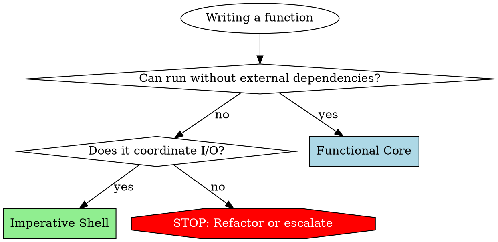

# Coding preferences

Apply these preferences whenever writing or refactoring code. Only disregard
them when explicitly instructed to by a user request or when they conflict with
established conventions in the surrounding code.

## Principles

### 1. Correctness over Convenience

Model the full error space. No shortcuts.

**Do:**
- Handle all edge cases: race conditions, timing issues, partial failures
- Use the type system to encode correctness constraints
- Prefer compile-time guarantees over runtime checks where possible
- When uncertain, explore and iterate rather than assume

**Don't:**
- Simplify error handling to save time
- Ignore edge cases because "they probably won't happen"
- Use `any` or equivalent to bypass type checking

### 2. Pragmatic Incrementalism

Make incremental changes only as needed.

**Do:**
- Prefer specific, composable logic over abstract frameworks
- Evolve design incrementally rather than perfect upfront architecture
- Document design decisions and trade-offs when making non-obvious choices
- Apply rule of three to abstraction (abstract only once you've seen the pattern three times)

**Don't:**
- Build for hypothetical future requirements
- Abstract until you've seen the pattern three times (three similar lines of code is better than a premature abstraction)

### 3. Functional Core Imperative Shell (FCIS)

Separate business logic from side effects using FCIS pattern.

**Techniques:**
Apply this code flow pattern universally.
```
1. GATHER (Shell):  Collect data from external sources
2. PROCESS (Core):  Transform input to output (pure)
3. PERSIST (Shell): Save results externally
```

Follow this decision framework before implementing functionality


**Questions to ask:**
- Can this logic run without file system, database, network, or environment?
  - **YES** -> Functional Core
  - **NO** -> Does it coordinate I/O or contain business logic?
    - **I/O coordination** -> Imperative Shell
    - **Business logic + I/O** -> STOP. Refactor or escalate to user.

#### Functional Core

**Contains ONLY:**
- Pure functions (same input -> same output, always)
- Business logic, validations, calculations, transformations
- Data structure operations
- Logging (EXCEPTION: loggers are permitted in Functional Core)

**NEVER contains:**
- File I/O (reading, writing files)
- Database operations (queries, updates, connections)
- HTTP requests or responses
- Environment variable access
- Date.now(), Math.random(), or other non-deterministic functions
- State mutations outside function scope

**Logging exception:** Functions MAY accept and use loggers. For unit tests, pass no-op loggers. This is the ONLY permitted side effect in Functional Core.

**Test signature:** Simple assertions, no mocks except logger (if used).

#### Imperative Shell

**Contains ONLY:**
- I/O operations: file system, database, HTTP, environment
- Orchestration: gather data -> call Functional Core -> persist results
- Error handling for I/O failures
- Minimal business logic (coordination only)

**NEVER contains:**
- Complex calculations
- Business rule validations
- Data transformations beyond format conversion

**Test signature:** Integration tests with real dependencies or test doubles.

### 4. Hygiene

- Follow local conventions
- Comments explain "Why?" and "How?". Comments only exceptionally explain "What?".
- Verbose names over imprecise/unclear names or comments
- Composition over inheritance
- Functional programming paradigms over imperative programming paradigms
